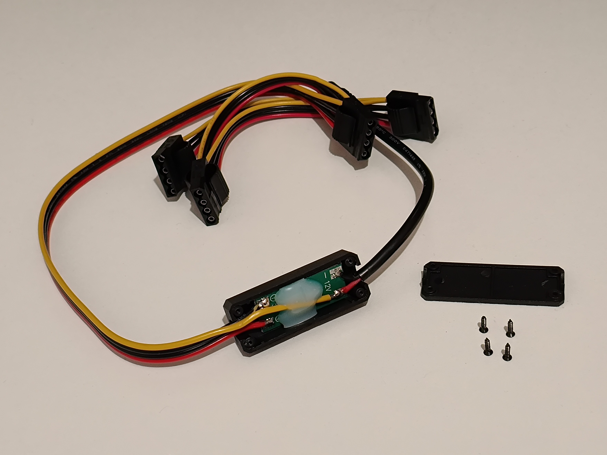
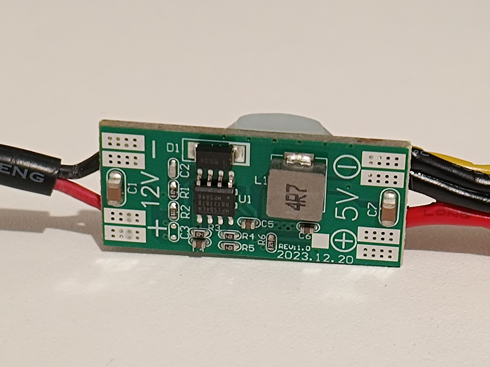

# 12V jack to Molex/SATA power cable

These come in multiple variants - 1-4 Molex or SATA plugs.

I got one with 4 Molex connectors.

The cable uses 
[MP1584](https://www.monolithicpower.com/en/documentview/productdocument/index/version/2/document_type/Datasheet/lang/en/sku/MP1584EN-LF-Z/document_id/204/?srsltid=AfmBOorrwqpzWkGxmQMnc-ybV-W3BEGFrd_9t6DMMAjr1ugpmtcPfVhz)
for 12V to 5V conversion which is rated for up to 3A.

It is good to mention that it doesnt supply 3.3V for SATA - but because just few devices really use it is not a big issue.