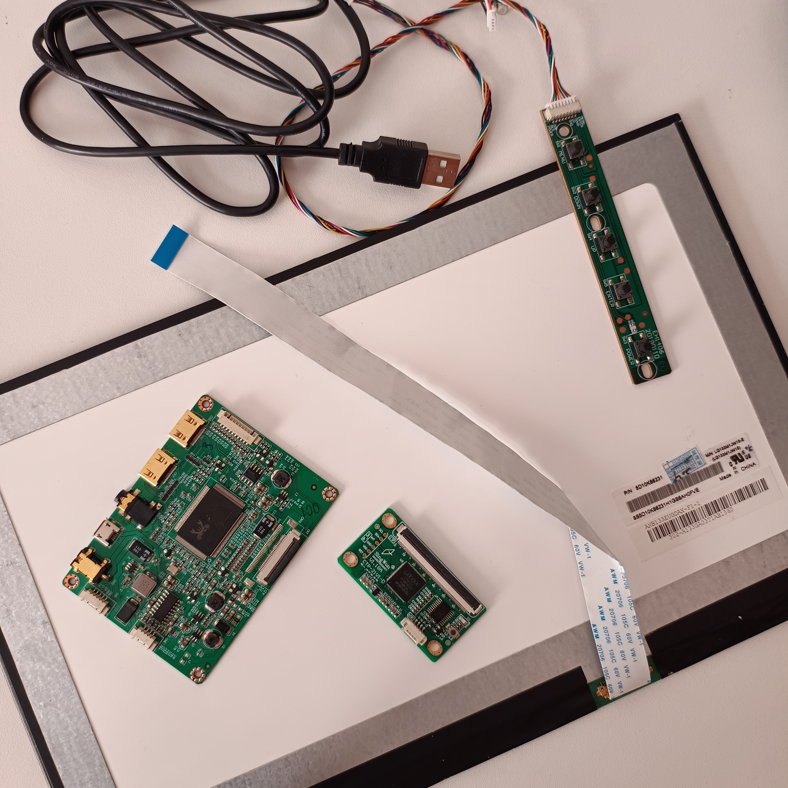
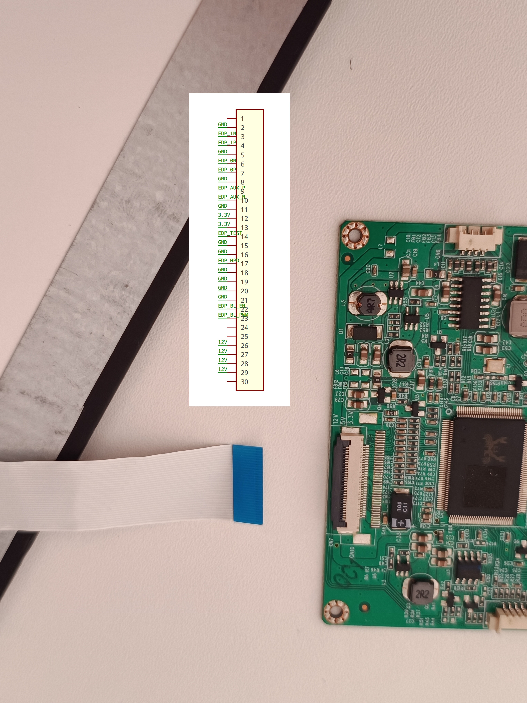
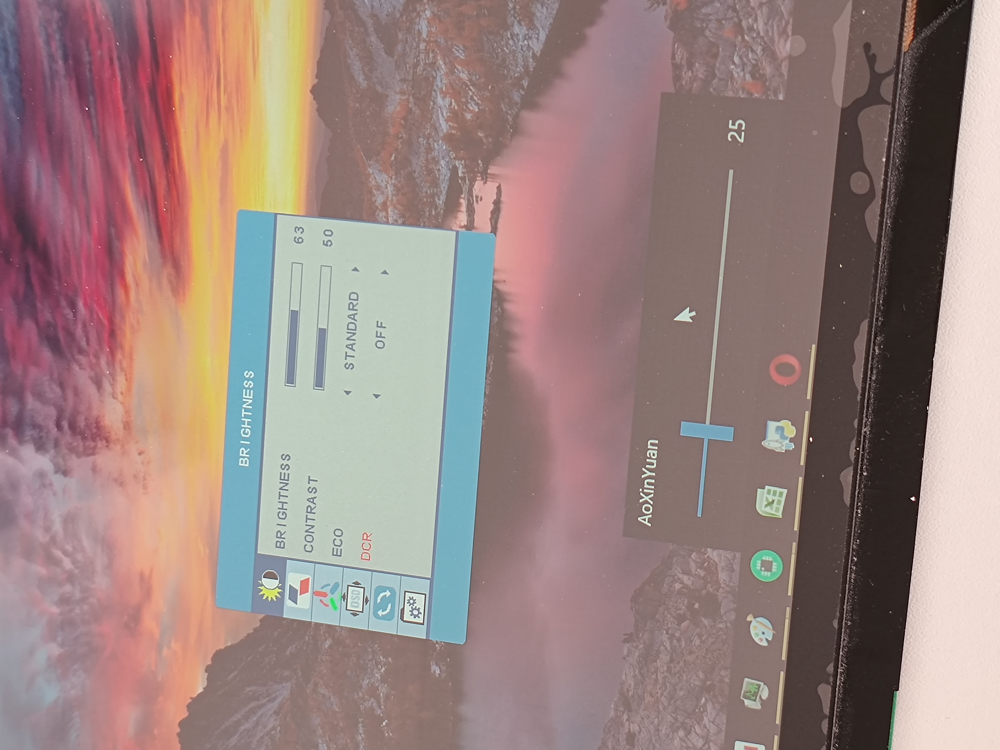

# LCD eDP 1080p 13.3" screen with driver board and touchscreen
Generally great display for DIY project.

**Pros:**
 * DDC/CI works
 * 10 point touch

**Cons:**
 * frame is not uniform
 * little thicker

**Buy:**
I bought mine from <https://www.aliexpress.com/item/32843347800.html> for about $100.

**Pics:**

*all items*

*screen*

*LCD driver board*

*touch driver*

**More:**

*pinout of the eDP FFC*

*it supports DDC/CI so you can control brightness from connected PC with software like Monitorian (i recomend to change the setting as is in the picture)*

*in case you dont want to waste USB for touch on platforms like Raspberry Pi you can connect it via I2C (the chip is GT9110, setup guide <https://gist.github.com/io4nn1s/20137898885209589e3f3bcff81453b4#file-gt9110_overlay-dts-L6> - for testing purposes you can ommit RST pin)*

