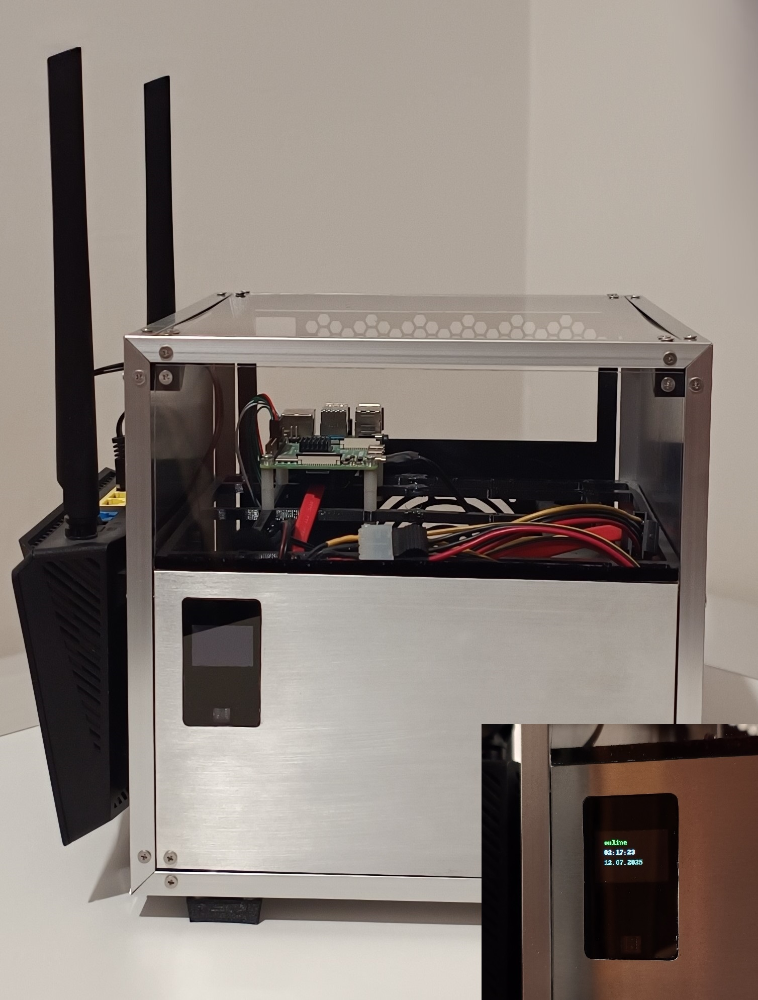

<!-- SORT FROM NEWEST TO OLDEST -->

## DIY IP camera
Raspberry Pi Zero 2W + Camera module with IR cut filter + some IR LEDs. \
(I'm going to make this open hardware+software soon, stay tuned.)

## My homelab server
DIY case from aluminium and 3D printed parts + OLED display and gesture sensor + Raspberry Pi + HDD. \
Guide and code for the display part [here](https://gist.github.com/mi4code/0ebb5886123edf615cbfee39fe3d29e8).

## My personal Wayland Linux desktop
Currently just background, simple panel and terminal built on top of HUI library. \
(*not open-source yet*)

## HUI
My own HTML webview UI library.

[github.com/mi4code/HUI](https://github.com/mi4code/HUI)

## onscreen-hid
Onscreen keyboard and touchpad.

[github.com/mi4code/onscreen-hid](https://github.com/mi4code/onscreen-hid)

## pycalc
Tiny terminal/calculator with ESP32S3 inside.

[gist.github.com](https://gist.github.com/mi4code/5f5a57915fbcb99b368e042995a4e84a)

## Light One
Smart light with web interface based on ESP8266/ESP32.

<video controls>
  <source src="lightsw.mp4" type="video/mp4">
</video>

<video controls>
  <source src="lighthw.mp4" type="video/mp4">
</video>

## 16 game
My first good programming project - simple sliding puzzle console game in C++.

